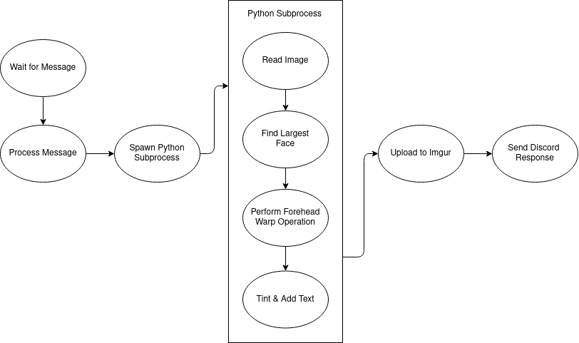

# No Bitches Bot

This repository contains a Discord bot that will take any image containing a face and mutilate it until it reasonably resembles a [Megamind meme](https://knowyourmeme.com/memes/no-bitches).

## Bot Architecture

### Forehead Transform

