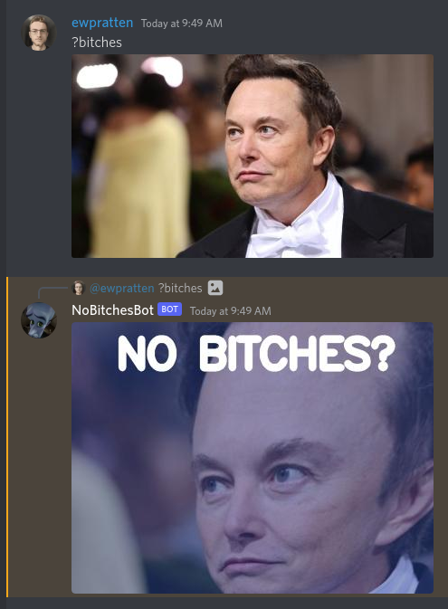

# No Bitches Bot

This repository contains a Discord bot that will take any image containing a face and mutilate it until it reasonably resembles a [Megamind meme](https://knowyourmeme.com/memes/no-bitches).

*This project was made for [Meme Appreciation Month](https://va3zza.com/events/meme-month-2022/)*

## Bot Architecture

### Forehead Transform

The most complicated part of this whole bot is performing a perspective warp to enlarge the forehead.

I'm essentially pulling the chin to sit at `1/4` and `3/4` of the width of the image at the bottom, the top right of the head goes to the top right corner, and the top left is at `1/8` width.

## FAQ

### Q: Can I host this myself?

**A:** Yep. Please see my `docker-compose.yml`. I'll handle everything you need. Just be sure to set `$DISCORD_TOKEN` to your bot's token. (aka: make your own bot at [discord.com/developers](https://discord.com/developers/))

### Q: Why does this look like it was written in 25 minutes?

**A:** Yes.

### Q: How do use?

**A:** Refer to this screenshot:

---

Ok. have a nice day.
